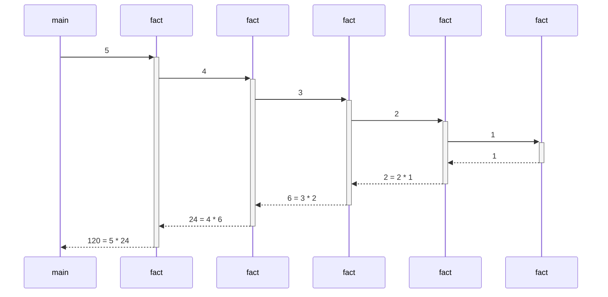
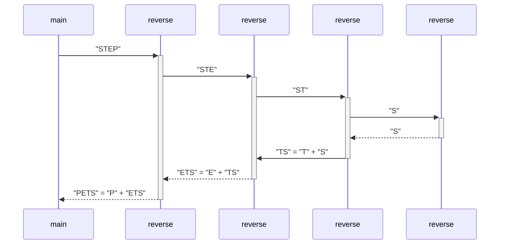
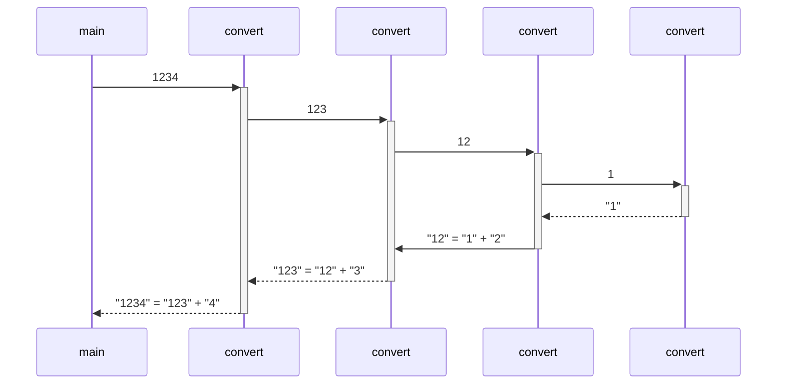
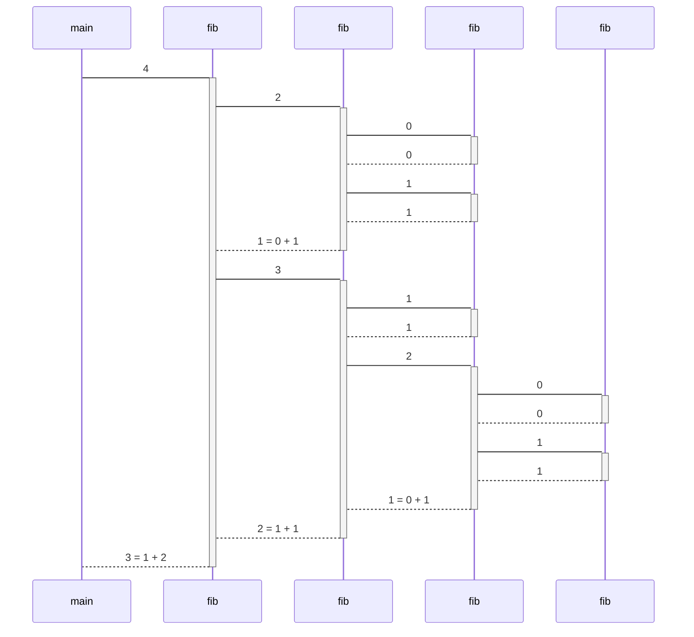

# codebar-recursion

## Factorial


### Python

```python
def fact(n: int) -> int:
  if n <= 1:
    return 1
  else:
    return n * fact(n - 1)

print(fact(5))
```

### Java

```java
public class Factorial {
  public static void main(String[] args) {
    System.out.println(fact(5));
  }

  public static int fact(int n) {
    if (n <= 1) {
      return 1;
    } else {
      return n * fact(n - 1);
    }
  }
}
```

## Reverse



### Python

```python
def reverse(text: str) -> str:
  if len(text) <= 1:
    return text
  else:
    return text[-1] + reverse(text[0:-1])

print(reverse("STEP"))
```

### Java

```java
public class Reverse {
  public static void main(String[] args) {
    System.out.println(reverse("STEP"));
  }

  public static String reverse(String text) {
    int len = text.length();
    if (len <= 1) {
      return text;
    } else {
      return text.charAt(len - 1) + reverse(text.substring(0, len - 1));
    }
  }
}
```

## Convert



### Python

```python
def convert(number: int) -> str:
  if number < 10:
    return str(number)
  else:
    return convert(number // 10) + str(number % 10)

print(convert(1234))
```

### Java

```java
public class Convert {
  public static void main(String[] args) {
    System.out.println(convert(1234));
  }

  public static String convert(int number) {
    if (number < 10) {
      return "0123456789".charAt(number) + "";
    } else {
      return convert(number / 10) + (number % 10);
    }
  }
}
```

## Fibonacci



### Python

```python
def fib(n: int) -> int:
    if n < 2:
        return n
    else:
        return fib(n - 2) + fib(n - 1)

print(fib(4))
```

### Java

```java
public class Fibonacci {
  public static void main(String[] args) {
    System.out.println(fib(4));
  }

  public static int fib(int n) {
    if (n < 2) {
      return n;
    } else {
      return fib(n - 2) + fib(n - 1);
    }
  }
}
```
