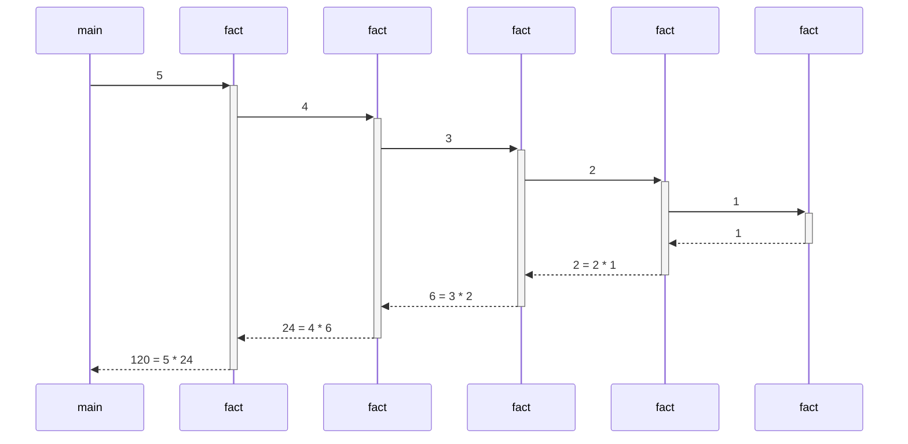

# codebar-recursion

## Factorial


### Python

```python
def fact(n: int) -> int:
  if n <= 1:
    return 1
  else:
    return n * fact(n - 1)

print(fact(5))
```

### Java

```java
public class Factorial {
  public static void main(String[] args) {
    System.out.println(fact(5));
  }

  public static int fact(int n) {
    if (n <= 1) {
      return 1;
    } else {
      return n * fact(n - 1);
    }
  }
}
```
