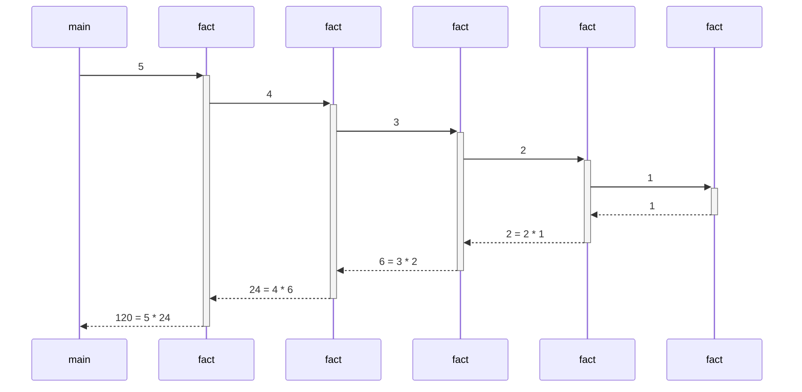
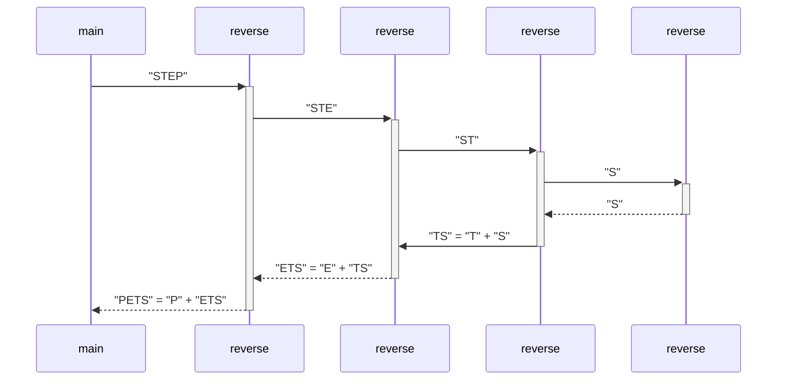
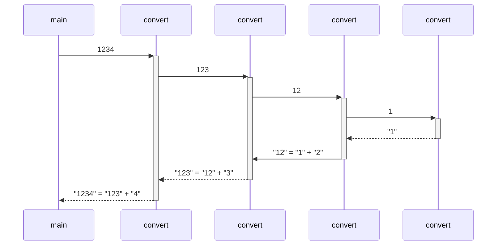
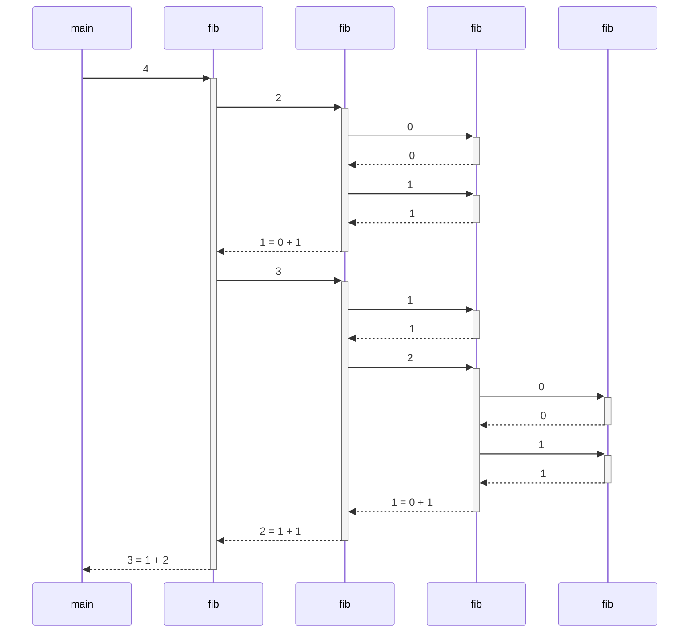
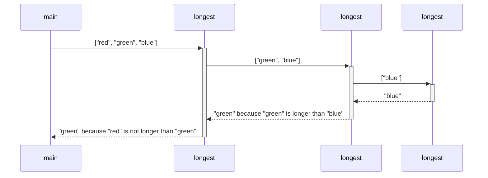
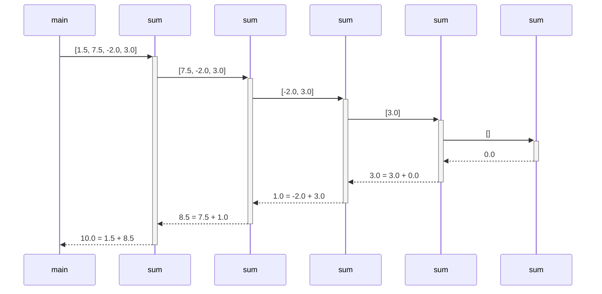

# codebar-recursion

* [Factorial](#factorial)
* [Reverse](#reverse)
* [Convert](#convert)
* [Fibonacci](#fibonacci)
* [Longest](#longest)
* [Sum](#sum)

## Factorial


### Python [:arrow_forward:](https://pythontutor.com/visualize.html#code=def%20fact%28n%3A%20int%29%20-%3E%20int%3A%0A%20%20if%20n%20%3C%3D%201%3A%0A%20%20%20%20return%201%0A%20%20else%3A%0A%20%20%20%20return%20n%20*%20fact%28n%20-%201%29%0A%0Aprint%28fact%285%29%29&cumulative=false&heapPrimitives=nevernest&mode=edit&origin=opt-frontend.js&py=3&rawInputLstJSON=%5B%5D&textReferences=false)

```python
def fact(n: int) -> int:
  if n <= 1:
    return 1
  else:
    return n * fact(n - 1)

print(fact(5))
```

### Java [:arrow_forward:](https://pythontutor.com/visualize.html#code=public%20class%20Factorial%20%7B%0A%20%20public%20static%20void%20main%28String%5B%5D%20args%29%20%7B%0A%20%20%20%20System.out.println%28fact%285%29%29%3B%0A%20%20%7D%0A%0A%20%20public%20static%20int%20fact%28int%20n%29%20%7B%0A%20%20%20%20if%20%28n%20%3C%3D%201%29%20%7B%0A%20%20%20%20%20%20return%201%3B%0A%20%20%20%20%7D%20else%20%7B%0A%20%20%20%20%20%20return%20n%20*%20fact%28n%20-%201%29%3B%0A%20%20%20%20%7D%0A%20%20%7D%0A%7D&cumulative=false&heapPrimitives=nevernest&mode=edit&origin=opt-frontend.js&py=java&rawInputLstJSON=%5B%5D&textReferences=false)

```java
public class Factorial {
  public static void main(String[] args) {
    System.out.println(fact(5));
  }

  public static int fact(int n) {
    if (n <= 1) {
      return 1;
    } else {
      return n * fact(n - 1);
    }
  }
}
```

## Reverse



### Python [:arrow_forward:](https://pythontutor.com/visualize.html#code=def%20reverse%28text%3A%20str%29%20-%3E%20str%3A%0A%20%20if%20len%28text%29%20%3C%3D%201%3A%0A%20%20%20%20return%20text%0A%20%20else%3A%0A%20%20%20%20return%20text%5B-1%5D%20%2B%20reverse%28text%5B0%3A-1%5D%29%0A%0Aprint%28reverse%28%22STEP%22%29%29&cumulative=false&heapPrimitives=nevernest&mode=edit&origin=opt-frontend.js&py=3&rawInputLstJSON=%5B%5D&textReferences=false)

```python
def reverse(text: str) -> str:
  if len(text) <= 1:
    return text
  else:
    return text[-1] + reverse(text[0:-1])

print(reverse("STEP"))
```

### Java [:arrow_forward:](https://pythontutor.com/visualize.html#code=public%20class%20Reverse%20%7B%0A%20%20public%20static%20void%20main%28String%5B%5D%20args%29%20%7B%0A%20%20%20%20System.out.println%28reverse%28%22STEP%22%29%29%3B%0A%20%20%7D%0A%0A%20%20public%20static%20String%20reverse%28String%20text%29%20%7B%0A%20%20%20%20int%20len%20%3D%20text.length%28%29%3B%0A%20%20%20%20if%20%28len%20%3C%3D%201%29%20%7B%0A%20%20%20%20%20%20return%20text%3B%0A%20%20%20%20%7D%20else%20%7B%0A%20%20%20%20%20%20return%20text.charAt%28len%20-%201%29%20%2B%20reverse%28text.substring%280,%20len%20-%201%29%29%3B%0A%20%20%20%20%7D%0A%20%20%7D%0A%7D&cumulative=false&heapPrimitives=nevernest&mode=edit&origin=opt-frontend.js&py=java&rawInputLstJSON=%5B%5D&textReferences=false)

```java
public class Reverse {
  public static void main(String[] args) {
    System.out.println(reverse("STEP"));
  }

  public static String reverse(String text) {
    int len = text.length();
    if (len <= 1) {
      return text;
    } else {
      return text.charAt(len - 1) + reverse(text.substring(0, len - 1));
    }
  }
}
```

## Convert



### Python [:arrow_forward:](https://pythontutor.com/visualize.html#code=def%20convert%28number%3A%20int%29%20-%3E%20str%3A%0A%20%20if%20number%20%3C%2010%3A%0A%20%20%20%20return%20str%28number%29%0A%20%20else%3A%0A%20%20%20%20return%20convert%28number%20//%2010%29%20%2B%20str%28number%20%25%2010%29%0A%0Aprint%28convert%281234%29%29&cumulative=false&heapPrimitives=nevernest&mode=edit&origin=opt-frontend.js&py=3&rawInputLstJSON=%5B%5D&textReferences=false)

```python
def convert(number: int) -> str:
  if number < 10:
    return str(number)
  else:
    return convert(number // 10) + str(number % 10)

print(convert(1234))
```

### Java [:arrow_forward:](https://pythontutor.com/visualize.html#code=public%20class%20Convert%20%7B%0A%20%20public%20static%20void%20main%28String%5B%5D%20args%29%20%7B%0A%20%20%20%20System.out.println%28convert%281234%29%29%3B%0A%20%20%7D%0A%0A%20%20public%20static%20String%20convert%28int%20number%29%20%7B%0A%20%20%20%20if%20%28number%20%3C%2010%29%20%7B%0A%20%20%20%20%20%20return%20%220123456789%22.charAt%28number%29%20%2B%20%22%22%3B%0A%20%20%20%20%7D%20else%20%7B%0A%20%20%20%20%20%20return%20convert%28number%20/%2010%29%20%2B%20%28number%20%25%2010%29%3B%0A%20%20%20%20%7D%0A%20%20%7D%0A%7D&cumulative=false&heapPrimitives=nevernest&mode=edit&origin=opt-frontend.js&py=java&rawInputLstJSON=%5B%5D&textReferences=false)

```java
public class Convert {
  public static void main(String[] args) {
    System.out.println(convert(1234));
  }

  public static String convert(int number) {
    if (number < 10) {
      return "0123456789".charAt(number) + "";
    } else {
      return convert(number / 10) + (number % 10);
    }
  }
}
```

## Fibonacci



### Python [:arrow_forward:](https://pythontutor.com/visualize.html#code=def%20fib%28n%3A%20int%29%20-%3E%20int%3A%0A%20%20%20%20if%20n%20%3C%202%3A%0A%20%20%20%20%20%20%20%20return%20n%0A%20%20%20%20else%3A%0A%20%20%20%20%20%20%20%20return%20fib%28n%20-%202%29%20%2B%20fib%28n%20-%201%29%0A%0Aprint%28fib%284%29%29&cumulative=false&heapPrimitives=nevernest&mode=edit&origin=opt-frontend.js&py=3&rawInputLstJSON=%5B%5D&textReferences=false)

```python
def fib(n: int) -> int:
    if n < 2:
        return n
    else:
        return fib(n - 2) + fib(n - 1)

print(fib(4))
```

### Java [:arrow_forward:](https://pythontutor.com/visualize.html#code=public%20class%20Fibonacci%20%7B%0A%20%20public%20static%20void%20main%28String%5B%5D%20args%29%20%7B%0A%20%20%20%20System.out.println%28fib%284%29%29%3B%0A%20%20%7D%0A%0A%20%20public%20static%20int%20fib%28int%20n%29%20%7B%0A%20%20%20%20if%20%28n%20%3C%202%29%20%7B%0A%20%20%20%20%20%20return%20n%3B%0A%20%20%20%20%7D%20else%20%7B%0A%20%20%20%20%20%20return%20fib%28n%20-%202%29%20%2B%20fib%28n%20-%201%29%3B%0A%20%20%20%20%7D%0A%20%20%7D%0A%7D&cumulative=false&heapPrimitives=nevernest&mode=edit&origin=opt-frontend.js&py=java&rawInputLstJSON=%5B%5D&textReferences=false)

```java
public class Fibonacci {
  public static void main(String[] args) {
    System.out.println(fib(4));
  }

  public static int fib(int n) {
    if (n < 2) {
      return n;
    } else {
      return fib(n - 2) + fib(n - 1);
    }
  }
}
```

## Longest



### Python [:arrow_forward:](https://pythontutor.com/visualize.html#code=def%20longest%28words%3A%20list%29%20-%3E%20str%3A%0A%20%20%20%20if%20len%28words%29%20%3D%3D%201%3A%0A%20%20%20%20%20%20%20%20return%20words%5B0%5D%0A%20%20%20%20else%3A%0A%20%20%20%20%20%20%20%20longest_of_rest%20%3D%20longest%28words%5B1%3A%5D%29%0A%20%20%20%20%20%20%20%20if%20len%28words%5B0%5D%29%20%3E%20len%28longest_of_rest%29%3A%0A%20%20%20%20%20%20%20%20%20%20%20%20return%20words%5B0%5D%0A%20%20%20%20%20%20%20%20else%3A%0A%20%20%20%20%20%20%20%20%20%20%20%20return%20longest_of_rest%0A%0Aprint%28longest%28%5B%22red%22,%20%22green%22,%20%22blue%22%5D%29%29&cumulative=false&heapPrimitives=nevernest&mode=edit&origin=opt-frontend.js&py=3&rawInputLstJSON=%5B%5D&textReferences=false)

```python
def longest(words: list[str]) -> str:
    if len(words) == 1:
        return words[0]
    else:
        longest_of_rest = longest(words[1:])
        if len(words[0]) > len(longest_of_rest):
            return words[0]
        else:
            return longest_of_rest

print(longest(["red", "green", "blue"]))
```

### Java [:arrow_forward:](https://pythontutor.com/visualize.html#code=import%20java.util.Arrays%3B%0A%0Apublic%20class%20Longest%20%7B%0A%20%20public%20static%20void%20main%28String%5B%5D%20args%29%20%7B%0A%20%20%20%20System.out.println%28longest%28new%20String%5B%5D%20%7B%22red%22,%20%22green%22,%20%22blue%22%7D%29%29%3B%0A%20%20%7D%0A%0A%20%20public%20static%20String%20longest%28String%5B%5D%20words%29%20%7B%0A%20%20%20%20if%20%28words.length%20%3D%3D%201%29%20%7B%0A%20%20%20%20%20%20return%20words%5B0%5D%3B%0A%20%20%20%20%7D%20else%7B%0A%20%20%20%20%20%20String%5B%5D%20rest%20%3D%20Arrays.copyOfRange%28words,%201,%20words.length%29%3B%0A%20%20%20%20%20%20String%20longestOfRest%20%3D%20longest%28rest%29%3B%0A%20%20%20%20%20%20if%20%28words%5B0%5D.length%28%29%20%3E%20longestOfRest.length%28%29%29%20%7B%0A%20%20%20%20%20%20%20%20return%20words%5B0%5D%3B%0A%20%20%20%20%20%20%7D%20else%20%7B%0A%20%20%20%20%20%20%20%20return%20longestOfRest%3B%0A%20%20%20%20%20%20%7D%0A%20%20%20%20%7D%0A%20%20%7D%0A%7D&cumulative=false&heapPrimitives=nevernest&mode=edit&origin=opt-frontend.js&py=java&rawInputLstJSON=%5B%5D&textReferences=false)

```java
import java.util.Arrays;

public class Longest {
  public static void main(String[] args) {
    System.out.println(longest(new String[] {"red", "green", "blue"}));
  }

  public static String longest(String[] words) {
    if (words.length == 1) {
      return words[0];
    } else {
      String[] rest = Arrays.copyOfRange(words, 1, words.length);
      String longestOfRest = longest(rest);
      if (words[0].length() > longestOfRest.length()) {
        return words[0];
      } else {
        return longestOfRest;
      }
    }
  }
}
```

## Sum



### Python [:arrow_forward:](https://pythontutor.com/visualize.html#code=def%20sum%28numbers%3A%20list%29%20-%3E%20str%3A%0A%20%20%20%20if%20len%28numbers%29%20%3D%3D%200%3A%0A%20%20%20%20%20%20%20%20return%200.0%0A%20%20%20%20else%3A%0A%20%20%20%20%20%20%20%20return%20numbers%5B0%5D%20%2B%20sum%28numbers%5B1%3A%5D%29%0A%0Aprint%28sum%28%5B1.5,%207.5,%20-2.0,%203.0%5D%29%29&cumulative=false&heapPrimitives=nevernest&mode=edit&origin=opt-frontend.js&py=3&rawInputLstJSON=%5B%5D&textReferences=false)

```python
def sum(numbers: list[float]) -> str:
    if len(numbers) == 0:
        return 0.0
    else:
        return numbers[0] + sum(numbers[1:])

print(sum([1.5, 7.5, -2.0, 3.0]))
```

### Java [:arrow_forward:](https://pythontutor.com/visualize.html#code=import%20java.util.Arrays%3B%0Aimport%20java.util.List%3B%0A%0Apublic%20class%20Main%20%7B%0A%20%20%20%20public%20static%20void%20main%28String%5B%5D%20args%29%20%7B%0A%20%20%20%20%20%20%20%20System.out.println%28sum%28Arrays.asList%28new%20Double%5B%5D%20%7B1.5,%207.5,%20-2.0,%203.0%7D%29%29%29%3B%0A%20%20%20%20%7D%0A%0A%20%20%20%20public%20static%20double%20sum%28List%3CDouble%3E%20numbers%29%20%7B%0A%20%20%20%20%20%20%20%20if%20%28numbers.size%28%29%20%3D%3D%200%29%20%7B%0A%20%20%20%20%20%20%20%20%20%20%20%20return%200.0%3B%0A%20%20%20%20%20%20%20%20%7D%20else%20%7B%0A%20%20%20%20%20%20%20%20%20%20%20%20Double%20first%20%3D%20numbers.get%280%29%3B%0A%20%20%20%20%20%20%20%20%20%20%20%20List%3CDouble%3E%20rest%20%3D%20numbers.subList%281,%20numbers.size%28%29%29%3B%0A%20%20%20%20%20%20%20%20%20%20%20%20return%20first%20%2B%20sum%28rest%29%3B%0A%20%20%20%20%20%20%20%20%7D%0A%20%20%20%20%7D%0A%7D&cumulative=false&heapPrimitives=nevernest&mode=edit&origin=opt-frontend.js&py=java&rawInputLstJSON=%5B%5D&textReferences=false)

```java
import java.util.List;

public class Main {
    public static void main(String[] args) {
        System.out.println(sum(List.<Double>of(1.5, 7.5, -2.0, 3.0)));
    }

    public static double sum(List<Double> numbers) {
        if (numbers.size() == 0) {
            return 0.0;
        } else {
            Double first = numbers.get(0);
            List<Double> rest = numbers.subList(1, numbers.size());
            return first + sum(rest);
        }
    }
}
```
