# codebar-recursion

* [Circles](#circles)
* [Lines](#lines)
* [Factorial](#factorial)
* [Reverse](#reverse)
* [Convert](#convert)
* [Fibonacci](#fibonacci)
* [Longest](#longest)
* [Sum](#sum)
* [Expression](#expression)
* [Quicksort](#quicksort)

## Circles

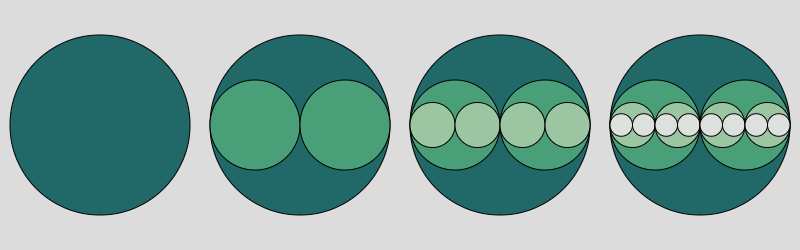

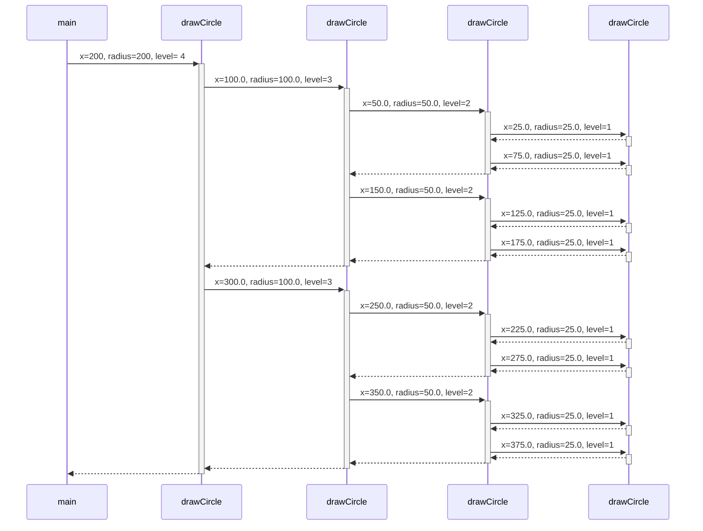

### Javascript ([p5.js](https://p5js.org/)) [:arrow_forward:](https://editor.p5js.org/nicben/sketches/4YIlLS4FT)

```javascript
const N = 4;
const palette = ["#216869", "#49A078", "#9CC5A1", "#DCE1DE"];

function setup() {
  createCanvas(800, 250);
  noLoop();
}

function draw() {
  background(220);
  const diameter = width / N;
  const radius = diameter / 2;
  const gap = 10;
  for (let n = 1; n <= N; n++) {
    const x = radius + (n - 1) * diameter;
    drawCircle(x, radius - gap, n, 0);
  }
}

function drawCircle(x, radius, level, depth) {
  // 'level' is the variable that terminates the recursion once it reaches
  // a certain value (here, 1). If a terminating condition is not
  // specified, a recursive function keeps calling itself again and again
  // until it runs out of stack space - not a favourable outcome!
  fill(palette[depth % palette.length]);
  ellipse(x, height / 2, radius * 2, radius * 2);
  if (level > 1) {
    // 'level' decreases by 1 at every step and thus makes the terminating
    // condition attainable.
    drawCircle(x - radius / 2, radius / 2, level - 1, depth + 1);
    drawCircle(x + radius / 2, radius / 2, level - 1, depth + 1);
  }
}
```

## Lines

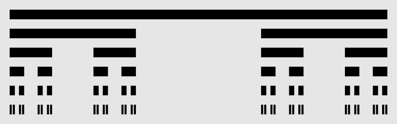

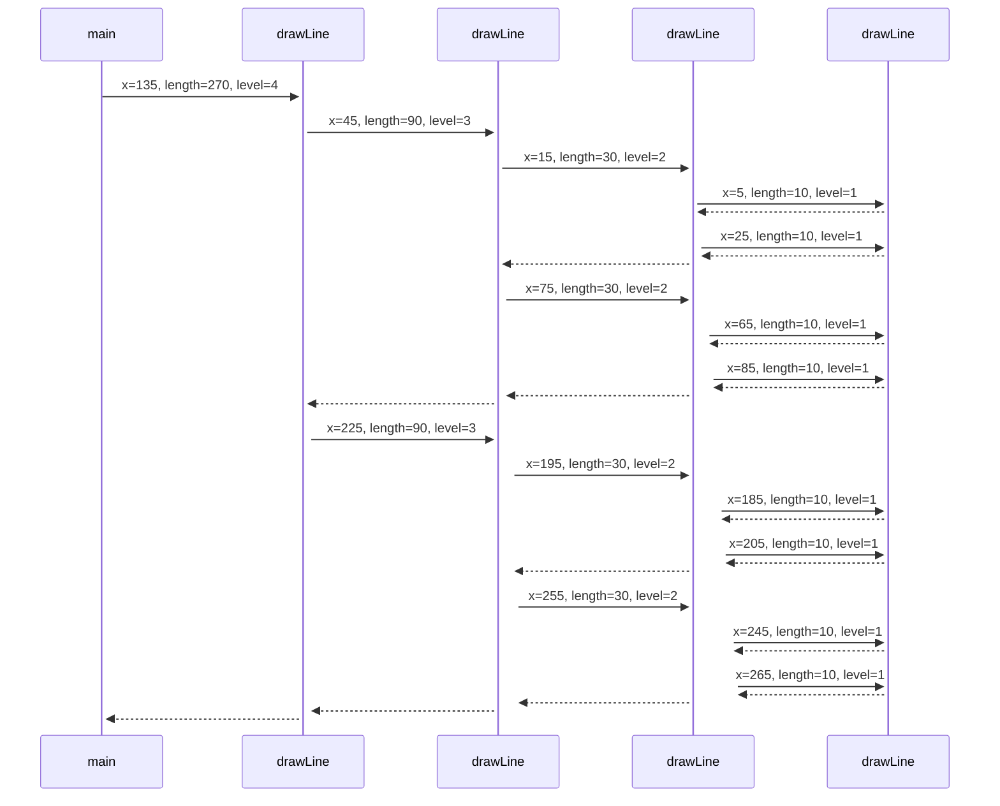

### Javascript ([p5.js](https://p5js.org/)) [:arrow_forward:](https://editor.p5js.org/nicben/sketches/OkPyavaqN)

```javascript
const N = 6;

function setup() {
  createCanvas(800, 250);
  rectMode(CENTER);
  fill(0);
  noStroke();
  noLoop();
}

function draw() {
  background(230);
  for (let n = 1; n <= N; n++) {
    const gap = 20;
    const thickness = (height - (N + 1) * gap) / N;
    const y = gap + thickness / 2 + (n - 1) * (gap + thickness);
    drawLine(width / 2, y, width - 2 * gap, thickness, n);
  }
}

function drawLine(x, y, length, thickness, level) {
  // 'level' is the variable that terminates the recursion once it reaches
  // a certain value (here, 1). If a terminating condition is not
  // specified, a recursive function keeps calling itself again and again
  // until it runs out of stack space - not a favourable outcome!
  if (level === 1) {
    rect(x, y, length, thickness);
  } else {
    // 'level' decreases by 1 at every step and thus makes the terminating
    // condition attainable.
    drawLine(x - length / 3, y, length / 3, thickness, level - 1);
    drawLine(x + length / 3, y, length / 3, thickness, level - 1);
  }
}
```

## Factorial

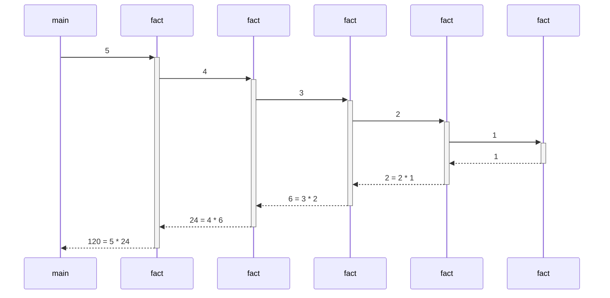
### Python [:arrow_forward:](https://pythontutor.com/visualize.html#code=def%20fact%28n%3A%20int%29%20-%3E%20int%3A%0A%20%20if%20n%20%3C%3D%201%3A%0A%20%20%20%20return%201%0A%20%20else%3A%0A%20%20%20%20return%20n%20*%20fact%28n%20-%201%29%0A%0Aprint%28fact%285%29%29&cumulative=false&heapPrimitives=nevernest&mode=edit&origin=opt-frontend.js&py=3&rawInputLstJSON=%5B%5D&textReferences=false)

```python
def fact(n: int) -> int:
  if n <= 1:
    return 1
  else:
    return n * fact(n - 1)

print(fact(5))
```

### Java [:arrow_forward:](https://pythontutor.com/visualize.html#code=public%20class%20Factorial%20%7B%0A%20%20public%20static%20void%20main%28String%5B%5D%20args%29%20%7B%0A%20%20%20%20System.out.println%28fact%285%29%29%3B%0A%20%20%7D%0A%0A%20%20public%20static%20int%20fact%28int%20n%29%20%7B%0A%20%20%20%20if%20%28n%20%3C%3D%201%29%20%7B%0A%20%20%20%20%20%20return%201%3B%0A%20%20%20%20%7D%20else%20%7B%0A%20%20%20%20%20%20return%20n%20*%20fact%28n%20-%201%29%3B%0A%20%20%20%20%7D%0A%20%20%7D%0A%7D&cumulative=false&heapPrimitives=nevernest&mode=edit&origin=opt-frontend.js&py=java&rawInputLstJSON=%5B%5D&textReferences=false)

```java
public class Factorial {
  public static void main(String[] args) {
    System.out.println(fact(5));
  }

  public static int fact(int n) {
    if (n <= 1) {
      return 1;
    } else {
      return n * fact(n - 1);
    }
  }
}
```

## Reverse

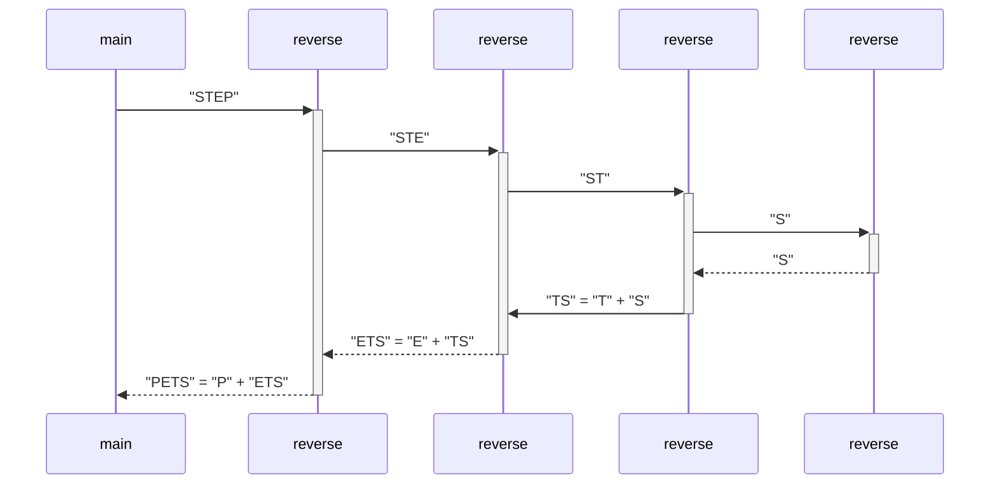

### Python [:arrow_forward:](https://pythontutor.com/visualize.html#code=def%20reverse%28text%3A%20str%29%20-%3E%20str%3A%0A%20%20if%20len%28text%29%20%3C%3D%201%3A%0A%20%20%20%20return%20text%0A%20%20else%3A%0A%20%20%20%20return%20text%5B-1%5D%20%2B%20reverse%28text%5B0%3A-1%5D%29%0A%0Aprint%28reverse%28%22STEP%22%29%29&cumulative=false&heapPrimitives=nevernest&mode=edit&origin=opt-frontend.js&py=3&rawInputLstJSON=%5B%5D&textReferences=false)

```python
def reverse(text: str) -> str:
  if len(text) <= 1:
    return text
  else:
    return text[-1] + reverse(text[0:-1])

print(reverse("STEP"))
```

### Java [:arrow_forward:](https://pythontutor.com/visualize.html#code=public%20class%20Reverse%20%7B%0A%20%20public%20static%20void%20main%28String%5B%5D%20args%29%20%7B%0A%20%20%20%20System.out.println%28reverse%28%22STEP%22%29%29%3B%0A%20%20%7D%0A%0A%20%20public%20static%20String%20reverse%28String%20text%29%20%7B%0A%20%20%20%20int%20len%20%3D%20text.length%28%29%3B%0A%20%20%20%20if%20%28len%20%3C%3D%201%29%20%7B%0A%20%20%20%20%20%20return%20text%3B%0A%20%20%20%20%7D%20else%20%7B%0A%20%20%20%20%20%20return%20text.charAt%28len%20-%201%29%20%2B%20reverse%28text.substring%280,%20len%20-%201%29%29%3B%0A%20%20%20%20%7D%0A%20%20%7D%0A%7D&cumulative=false&heapPrimitives=nevernest&mode=edit&origin=opt-frontend.js&py=java&rawInputLstJSON=%5B%5D&textReferences=false)

```java
public class Reverse {
  public static void main(String[] args) {
    System.out.println(reverse("STEP"));
  }

  public static String reverse(String text) {
    int len = text.length();
    if (len <= 1) {
      return text;
    } else {
      return text.charAt(len - 1) + reverse(text.substring(0, len - 1));
    }
  }
}
```

## Convert

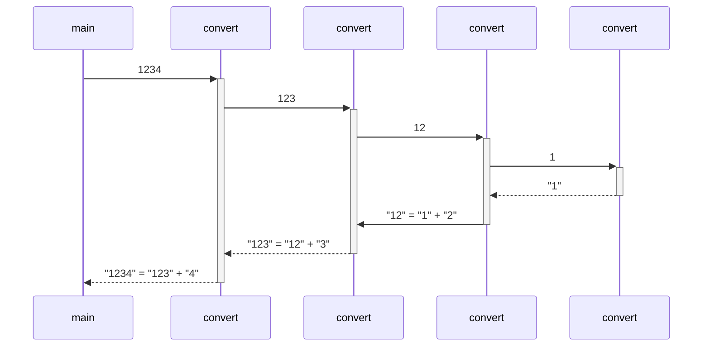

### Python [:arrow_forward:](https://pythontutor.com/visualize.html#code=def%20convert%28number%3A%20int%29%20-%3E%20str%3A%0A%20%20if%20number%20%3C%2010%3A%0A%20%20%20%20return%20str%28number%29%0A%20%20else%3A%0A%20%20%20%20return%20convert%28number%20//%2010%29%20%2B%20str%28number%20%25%2010%29%0A%0Aprint%28convert%281234%29%29&cumulative=false&heapPrimitives=nevernest&mode=edit&origin=opt-frontend.js&py=3&rawInputLstJSON=%5B%5D&textReferences=false)

```python
def convert(number: int) -> str:
  if number < 10:
    return str(number)
  else:
    return convert(number // 10) + str(number % 10)

print(convert(1234))
```

### Java [:arrow_forward:](https://pythontutor.com/visualize.html#code=public%20class%20Convert%20%7B%0A%20%20public%20static%20void%20main%28String%5B%5D%20args%29%20%7B%0A%20%20%20%20System.out.println%28convert%281234%29%29%3B%0A%20%20%7D%0A%0A%20%20public%20static%20String%20convert%28int%20number%29%20%7B%0A%20%20%20%20if%20%28number%20%3C%2010%29%20%7B%0A%20%20%20%20%20%20return%20%220123456789%22.charAt%28number%29%20%2B%20%22%22%3B%0A%20%20%20%20%7D%20else%20%7B%0A%20%20%20%20%20%20return%20convert%28number%20/%2010%29%20%2B%20%28number%20%25%2010%29%3B%0A%20%20%20%20%7D%0A%20%20%7D%0A%7D&cumulative=false&heapPrimitives=nevernest&mode=edit&origin=opt-frontend.js&py=java&rawInputLstJSON=%5B%5D&textReferences=false)

```java
public class Convert {
  public static void main(String[] args) {
    System.out.println(convert(1234));
  }

  public static String convert(int number) {
    if (number < 10) {
      return "0123456789".charAt(number) + "";
    } else {
      return convert(number / 10) + (number % 10);
    }
  }
}
```

## Fibonacci

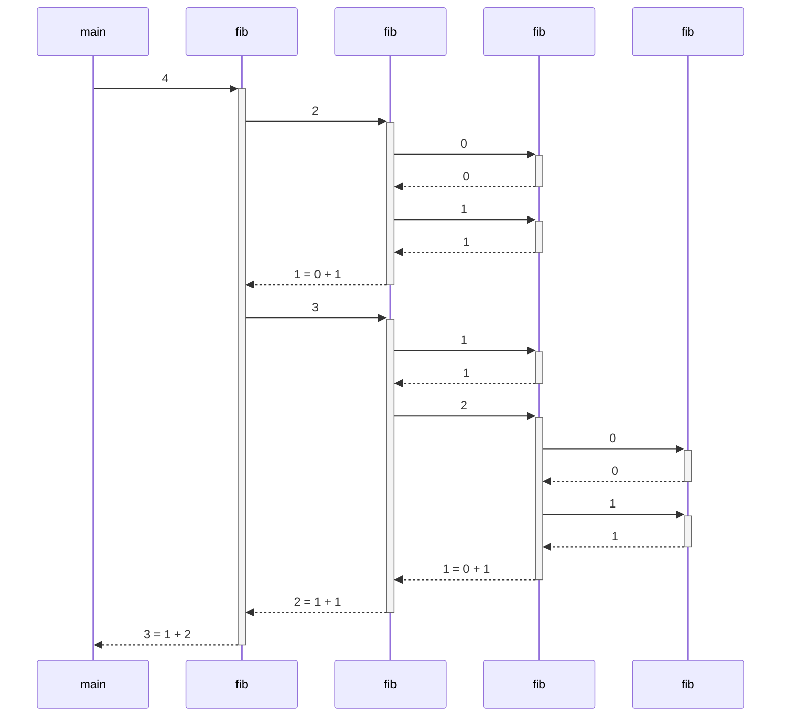

### Python [:arrow_forward:](https://pythontutor.com/visualize.html#code=def%20fib%28n%3A%20int%29%20-%3E%20int%3A%0A%20%20%20%20if%20n%20%3C%202%3A%0A%20%20%20%20%20%20%20%20return%20n%0A%20%20%20%20else%3A%0A%20%20%20%20%20%20%20%20return%20fib%28n%20-%202%29%20%2B%20fib%28n%20-%201%29%0A%0Aprint%28fib%284%29%29&cumulative=false&heapPrimitives=nevernest&mode=edit&origin=opt-frontend.js&py=3&rawInputLstJSON=%5B%5D&textReferences=false)

```python
def fib(n: int) -> int:
    if n < 2:
        return n
    else:
        return fib(n - 2) + fib(n - 1)

print(fib(4))
```

### Java [:arrow_forward:](https://pythontutor.com/visualize.html#code=public%20class%20Fibonacci%20%7B%0A%20%20public%20static%20void%20main%28String%5B%5D%20args%29%20%7B%0A%20%20%20%20System.out.println%28fib%284%29%29%3B%0A%20%20%7D%0A%0A%20%20public%20static%20int%20fib%28int%20n%29%20%7B%0A%20%20%20%20if%20%28n%20%3C%202%29%20%7B%0A%20%20%20%20%20%20return%20n%3B%0A%20%20%20%20%7D%20else%20%7B%0A%20%20%20%20%20%20return%20fib%28n%20-%202%29%20%2B%20fib%28n%20-%201%29%3B%0A%20%20%20%20%7D%0A%20%20%7D%0A%7D&cumulative=false&heapPrimitives=nevernest&mode=edit&origin=opt-frontend.js&py=java&rawInputLstJSON=%5B%5D&textReferences=false)

```java
public class Fibonacci {
  public static void main(String[] args) {
    System.out.println(fib(4));
  }

  public static int fib(int n) {
    if (n < 2) {
      return n;
    } else {
      return fib(n - 2) + fib(n - 1);
    }
  }
}
```

## Longest

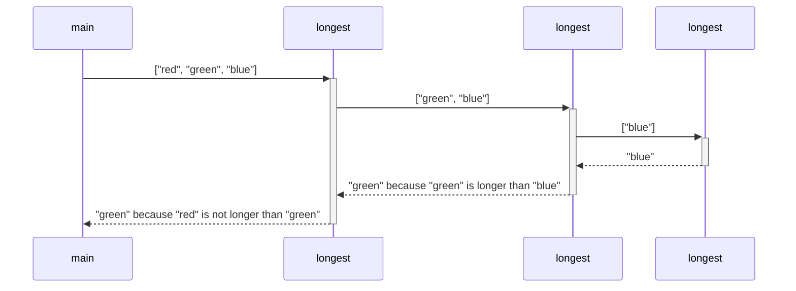

### Python [:arrow_forward:](https://pythontutor.com/visualize.html#code=def%20longest%28words%3A%20list%29%20-%3E%20str%3A%0A%20%20%20%20if%20len%28words%29%20%3D%3D%201%3A%0A%20%20%20%20%20%20%20%20return%20words%5B0%5D%0A%20%20%20%20else%3A%0A%20%20%20%20%20%20%20%20longest_of_rest%20%3D%20longest%28words%5B1%3A%5D%29%0A%20%20%20%20%20%20%20%20if%20len%28words%5B0%5D%29%20%3E%20len%28longest_of_rest%29%3A%0A%20%20%20%20%20%20%20%20%20%20%20%20return%20words%5B0%5D%0A%20%20%20%20%20%20%20%20else%3A%0A%20%20%20%20%20%20%20%20%20%20%20%20return%20longest_of_rest%0A%0Aprint%28longest%28%5B%22red%22,%20%22green%22,%20%22blue%22%5D%29%29&cumulative=false&heapPrimitives=nevernest&mode=edit&origin=opt-frontend.js&py=3&rawInputLstJSON=%5B%5D&textReferences=false)

```python
def longest(words: list[str]) -> str:
    if len(words) == 1:
        return words[0]
    else:
        longest_of_rest = longest(words[1:])
        if len(words[0]) > len(longest_of_rest):
            return words[0]
        else:
            return longest_of_rest

print(longest(["red", "green", "blue"]))
```

### Java [:arrow_forward:](https://pythontutor.com/visualize.html#code=import%20java.util.Arrays%3B%0A%0Apublic%20class%20Longest%20%7B%0A%20%20public%20static%20void%20main%28String%5B%5D%20args%29%20%7B%0A%20%20%20%20System.out.println%28longest%28new%20String%5B%5D%20%7B%22red%22,%20%22green%22,%20%22blue%22%7D%29%29%3B%0A%20%20%7D%0A%0A%20%20public%20static%20String%20longest%28String%5B%5D%20words%29%20%7B%0A%20%20%20%20if%20%28words.length%20%3D%3D%201%29%20%7B%0A%20%20%20%20%20%20return%20words%5B0%5D%3B%0A%20%20%20%20%7D%20else%7B%0A%20%20%20%20%20%20String%5B%5D%20rest%20%3D%20Arrays.copyOfRange%28words,%201,%20words.length%29%3B%0A%20%20%20%20%20%20String%20longestOfRest%20%3D%20longest%28rest%29%3B%0A%20%20%20%20%20%20if%20%28words%5B0%5D.length%28%29%20%3E%20longestOfRest.length%28%29%29%20%7B%0A%20%20%20%20%20%20%20%20return%20words%5B0%5D%3B%0A%20%20%20%20%20%20%7D%20else%20%7B%0A%20%20%20%20%20%20%20%20return%20longestOfRest%3B%0A%20%20%20%20%20%20%7D%0A%20%20%20%20%7D%0A%20%20%7D%0A%7D&cumulative=false&heapPrimitives=nevernest&mode=edit&origin=opt-frontend.js&py=java&rawInputLstJSON=%5B%5D&textReferences=false)

```java
import java.util.Arrays;

public class Longest {
  public static void main(String[] args) {
    System.out.println(longest(new String[] {"red", "green", "blue"}));
  }

  public static String longest(String[] words) {
    if (words.length == 1) {
      return words[0];
    } else {
      String[] rest = Arrays.copyOfRange(words, 1, words.length);
      String longestOfRest = longest(rest);
      if (words[0].length() > longestOfRest.length()) {
        return words[0];
      } else {
        return longestOfRest;
      }
    }
  }
}
```

## Sum

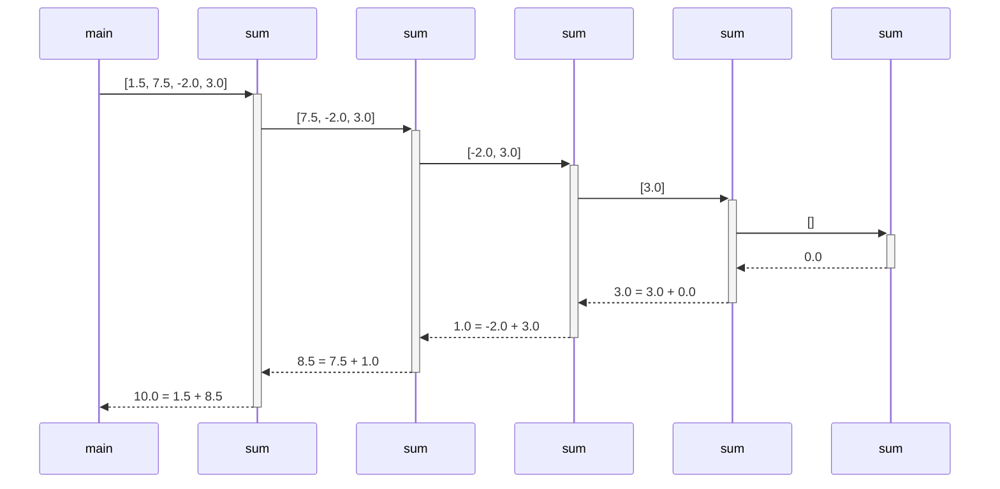

### Python [:arrow_forward:](https://pythontutor.com/visualize.html#code=def%20sum%28numbers%3A%20list%29%20-%3E%20str%3A%0A%20%20%20%20if%20len%28numbers%29%20%3D%3D%200%3A%0A%20%20%20%20%20%20%20%20return%200.0%0A%20%20%20%20else%3A%0A%20%20%20%20%20%20%20%20return%20numbers%5B0%5D%20%2B%20sum%28numbers%5B1%3A%5D%29%0A%0Aprint%28sum%28%5B1.5,%207.5,%20-2.0,%203.0%5D%29%29&cumulative=false&heapPrimitives=nevernest&mode=edit&origin=opt-frontend.js&py=3&rawInputLstJSON=%5B%5D&textReferences=false)

```python
def sum(numbers: list[float]) -> str:
    if len(numbers) == 0:
        return 0.0
    else:
        return numbers[0] + sum(numbers[1:])

print(sum([1.5, 7.5, -2.0, 3.0]))
```

### Java [:arrow_forward:](https://pythontutor.com/visualize.html#code=import%20java.util.Arrays%3B%0Aimport%20java.util.List%3B%0A%0Apublic%20class%20Main%20%7B%0A%20%20%20%20public%20static%20void%20main%28String%5B%5D%20args%29%20%7B%0A%20%20%20%20%20%20%20%20System.out.println%28sum%28Arrays.asList%28new%20Double%5B%5D%20%7B1.5,%207.5,%20-2.0,%203.0%7D%29%29%29%3B%0A%20%20%20%20%7D%0A%0A%20%20%20%20public%20static%20double%20sum%28List%3CDouble%3E%20numbers%29%20%7B%0A%20%20%20%20%20%20%20%20if%20%28numbers.size%28%29%20%3D%3D%200%29%20%7B%0A%20%20%20%20%20%20%20%20%20%20%20%20return%200.0%3B%0A%20%20%20%20%20%20%20%20%7D%20else%20%7B%0A%20%20%20%20%20%20%20%20%20%20%20%20Double%20first%20%3D%20numbers.get%280%29%3B%0A%20%20%20%20%20%20%20%20%20%20%20%20List%3CDouble%3E%20rest%20%3D%20numbers.subList%281,%20numbers.size%28%29%29%3B%0A%20%20%20%20%20%20%20%20%20%20%20%20return%20first%20%2B%20sum%28rest%29%3B%0A%20%20%20%20%20%20%20%20%7D%0A%20%20%20%20%7D%0A%7D&cumulative=false&heapPrimitives=nevernest&mode=edit&origin=opt-frontend.js&py=java&rawInputLstJSON=%5B%5D&textReferences=false)

```java
import java.util.List;

public class Main {
    public static void main(String[] args) {
        System.out.println(sum(List.<Double>of(1.5, 7.5, -2.0, 3.0)));
    }

    public static double sum(List<Double> numbers) {
        if (numbers.size() == 0) {
            return 0.0;
        } else {
            Double first = numbers.get(0);
            List<Double> rest = numbers.subList(1, numbers.size());
            return first + sum(rest);
        }
    }
}
```

## Expression

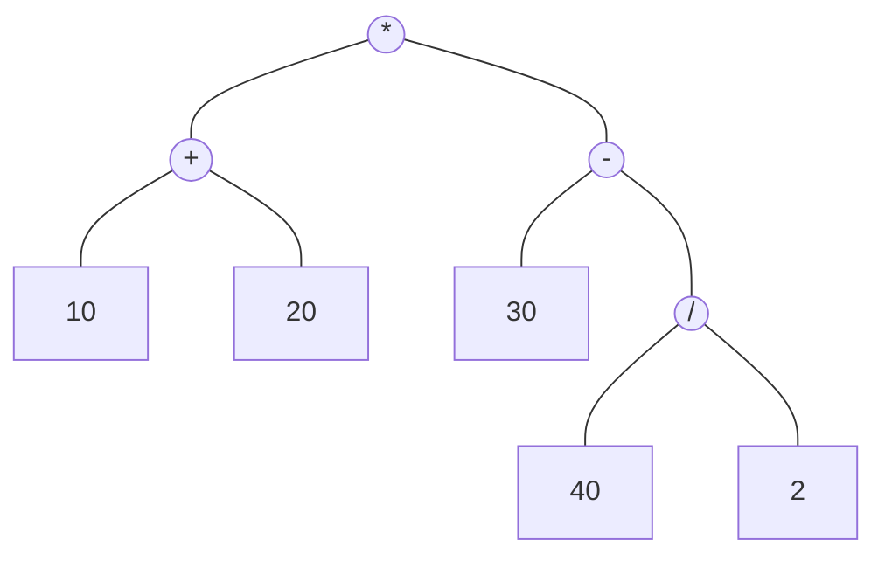

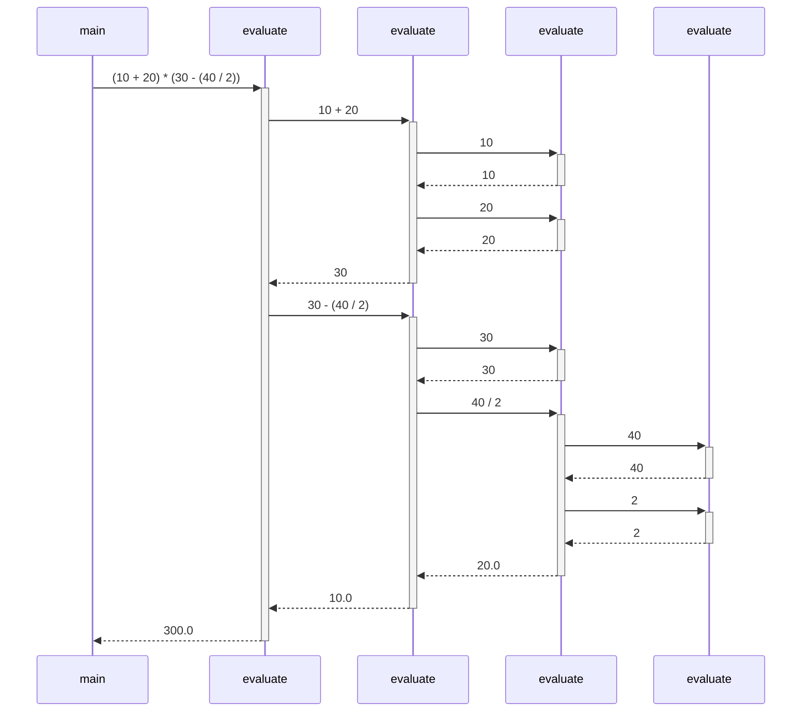

### Python [:arrow_forward:](https://pythontutor.com/visualize.html#code=class%20Expr%3A%0A%20%20%20%20def%20__init__%28self,%20left,%20op,%20right%29%3A%0A%20%20%20%20%20%20%20%20self.left%20%3D%20left%0A%20%20%20%20%20%20%20%20self.op%20%3D%20op%0A%20%20%20%20%20%20%20%20self.right%20%3D%20right%0A%0A%20%20%20%20def%20__str__%28self%29%3A%0A%20%20%20%20%20%20%20%20return%20f%22%28%7Bself.left%7D%20%7Bself.op%7D%20%7Bself.right%7D%29%22%0A%0Adef%20evaluate%28expr%29%3A%0A%20%20%20%20if%20isinstance%28expr,%20Expr%29%3A%0A%20%20%20%20%20%20%20%20left_val%20%3D%20evaluate%28expr.left%29%0A%20%20%20%20%20%20%20%20right_val%20%3D%20evaluate%28expr.right%29%0A%20%20%20%20%20%20%20%20if%20expr.op%20%3D%3D%20%22%2B%22%3A%0A%20%20%20%20%20%20%20%20%20%20%20%20return%20left_val%20%2B%20right_val%0A%20%20%20%20%20%20%20%20elif%20expr.op%20%3D%3D%20%22-%22%3A%0A%20%20%20%20%20%20%20%20%20%20%20%20return%20left_val%20-%20right_val%0A%20%20%20%20%20%20%20%20elif%20expr.op%20%3D%3D%20%22*%22%3A%0A%20%20%20%20%20%20%20%20%20%20%20%20return%20left_val%20*%20right_val%0A%20%20%20%20%20%20%20%20elif%20expr.op%20%3D%3D%20%22/%22%3A%0A%20%20%20%20%20%20%20%20%20%20%20%20return%20left_val%20/%20right_val%0A%20%20%20%20else%3A%0A%20%20%20%20%20%20%20%20return%20expr%0A%0A%23%20%2810%20%2B%2020%29%20*%20%2830%20-%20%2840%20/%202%29%29%0Aexpr%20%3D%20Expr%28Expr%2810,%20%22%2B%22,%2020%29,%20%22*%22,%20Expr%2830,%20%22-%22,%20Expr%2840,%20%22/%22,%202%29%29%29%0A%0Aprint%28expr,%20%22%3D%22,%20evaluate%28expr%29%29&cumulative=false&heapPrimitives=nevernest&mode=edit&origin=opt-frontend.js&py=3&rawInputLstJSON=%5B%5D&textReferences=false)

```python
from typing import TypeVar

TExpr = TypeVar("TExpr", bound="Expr|int|float")

class Expr:
    def __init__(self, left: TExpr, op: str, right: TExpr):
        self.left = left
        self.op = op
        self.right = right

    def __str__(self):
        return f"({self.left} {self.op} {self.right})"

def evaluate(expr: TExpr) -> float:
    if isinstance(expr, Expr):
        left_val = evaluate(expr.left)
        right_val = evaluate(expr.right)
        match expr.op:
            case "+":
                return left_val + right_val
            case "-":
                return left_val - right_val
            case "*":
                return left_val * right_val
            case "/":
                return left_val / right_val
    else:
        return expr

# (10 + 20) * (30 - (40 / 2))
expr = Expr(Expr(10, "+", 20), "*", Expr(30, "-", Expr(40, "/", 2)))

print(expr, "=", evaluate(expr))
```

### Java [:arrow_forward:](https://pythontutor.com/visualize.html#code=public%20class%20Main%20%7B%0A%20%20%20%20public%20static%20void%20main%28String%5B%5D%20args%29%20%7B%0A%20%20%20%20%20%20%20%20Expression%20expr%20%3D%20new%20OperationNode%28%0A%20%20%20%20%20%20%20%20%20%20%20%20new%20OperationNode%28new%20ValueNode%2810%29,%20%22%2B%22,%20new%20ValueNode%2820%29%29,%0A%20%20%20%20%20%20%20%20%20%20%20%20%22*%22,%0A%20%20%20%20%20%20%20%20%20%20%20%20new%20OperationNode%28%0A%20%20%20%20%20%20%20%20%20%20%20%20%20%20%20%20new%20ValueNode%2830%29,%0A%20%20%20%20%20%20%20%20%20%20%20%20%20%20%20%20%22-%22,%0A%20%20%20%20%20%20%20%20%20%20%20%20%20%20%20%20new%20OperationNode%28new%20ValueNode%2840%29,%20%22/%22,%20new%20ValueNode%282%29%29%0A%20%20%20%20%20%20%20%20%20%20%20%20%29%0A%20%20%20%20%20%20%20%20%29%3B%0A%20%20%20%20%20%20%20%20System.out.println%28expr%20%2B%20%22%20%3D%20%22%20%2B%20evaluate%28expr%29%29%3B%0A%20%20%20%20%7D%0A%0A%20%20%20%20public%20static%20double%20evaluate%28Expression%20expr%29%20%7B%0A%20%20%20%20%20%20%20%20if%20%28expr%20instanceof%20ValueNode%29%20%7B%0A%20%20%20%20%20%20%20%20%20%20%20%20return%20%28%28ValueNode%29%20expr%29.value%3B%0A%20%20%20%20%20%20%20%20%7D%20else%20%7B%0A%20%20%20%20%20%20%20%20%20%20%20%20OperationNode%20opNode%20%3D%20%28OperationNode%29%20expr%3B%0A%20%20%20%20%20%20%20%20%20%20%20%20Double%20leftVal%20%3D%20evaluate%28opNode.left%29%3B%0A%20%20%20%20%20%20%20%20%20%20%20%20Double%20rightVal%20%3D%20evaluate%28opNode.right%29%3B%0A%20%20%20%20%20%20%20%20%20%20%20%20switch%20%28opNode.op%29%20%7B%0A%20%20%20%20%20%20%20%20%20%20%20%20%20%20%20%20case%20%22%2B%22%3A%0A%20%20%20%20%20%20%20%20%20%20%20%20%20%20%20%20%20%20%20%20return%20leftVal%20%2B%20rightVal%3B%0A%20%20%20%20%20%20%20%20%20%20%20%20%20%20%20%20case%20%22-%22%3A%0A%20%20%20%20%20%20%20%20%20%20%20%20%20%20%20%20%20%20%20%20return%20leftVal%20-%20rightVal%3B%0A%20%20%20%20%20%20%20%20%20%20%20%20%20%20%20%20case%20%22*%22%3A%0A%20%20%20%20%20%20%20%20%20%20%20%20%20%20%20%20%20%20%20%20return%20leftVal%20*%20rightVal%3B%0A%20%20%20%20%20%20%20%20%20%20%20%20%20%20%20%20case%20%22/%22%3A%0A%20%20%20%20%20%20%20%20%20%20%20%20%20%20%20%20%20%20%20%20return%20leftVal%20/%20rightVal%3B%0A%20%20%20%20%20%20%20%20%20%20%20%20%20%20%20%20default%3A%0A%20%20%20%20%20%20%20%20%20%20%20%20%20%20%20%20%20%20%20%20throw%20new%20IllegalArgumentException%28%22Unsupported%20operator%3A%20%22%20%2B%20opNode.op%29%3B%0A%20%20%20%20%20%20%20%20%20%20%20%20%7D%0A%20%20%20%20%20%20%20%20%7D%0A%20%20%20%20%7D%0A%0A%20%20%20%20public%20interface%20Expression%20%7B%0A%20%20%20%20%7D%0A%0A%20%20%20%20public%20static%20class%20ValueNode%20implements%20Expression%20%7B%0A%20%20%20%20%20%20%20%20public%20final%20Double%20value%3B%0A%0A%20%20%20%20%20%20%20%20public%20ValueNode%28Double%20value%29%20%7B%0A%20%20%20%20%20%20%20%20%20%20%20%20this.value%20%3D%20value%3B%0A%20%20%20%20%20%20%20%20%7D%0A%0A%20%20%20%20%20%20%20%20public%20ValueNode%28Integer%20value%29%20%7B%0A%20%20%20%20%20%20%20%20%20%20%20%20this.value%20%3D%20value.doubleValue%28%29%3B%0A%20%20%20%20%20%20%20%20%7D%0A%0A%20%20%20%20%20%20%20%20%40Override%0A%20%20%20%20%20%20%20%20public%20String%20toString%28%29%20%7B%0A%20%20%20%20%20%20%20%20%20%20%20%20return%20value.toString%28%29%3B%0A%20%20%20%20%20%20%20%20%7D%0A%20%20%20%20%7D%0A%0A%20%20%20%20public%20static%20class%20OperationNode%20implements%20Expression%20%7B%0A%20%20%20%20%20%20%20%20public%20final%20Expression%20left%3B%0A%20%20%20%20%20%20%20%20public%20final%20String%20op%3B%0A%20%20%20%20%20%20%20%20public%20final%20Expression%20right%3B%0A%0A%20%20%20%20%20%20%20%20public%20OperationNode%28Expression%20left,%20String%20op,%20Expression%20right%29%20%7B%0A%20%20%20%20%20%20%20%20%20%20%20%20this.left%20%3D%20left%3B%0A%20%20%20%20%20%20%20%20%20%20%20%20this.op%20%3D%20op%3B%0A%20%20%20%20%20%20%20%20%20%20%20%20this.right%20%3D%20right%3B%0A%20%20%20%20%20%20%20%20%7D%0A%0A%20%20%20%20%20%20%20%20%40Override%0A%20%20%20%20%20%20%20%20public%20String%20toString%28%29%20%7B%0A%20%20%20%20%20%20%20%20%20%20%20%20return%20%22%28%22%20%2B%20left%20%2B%20%22%20%22%20%2B%20op%20%2B%20%22%20%22%20%2B%20right%20%2B%20%22%29%22%3B%0A%20%20%20%20%20%20%20%20%7D%0A%20%20%20%20%7D%0A%7D&cumulative=false&heapPrimitives=nevernest&mode=edit&origin=opt-frontend.js&py=java&rawInputLstJSON=%5B%5D&textReferences=false)

```java
public class Main {
    public static void main(String[] args) {
        // (10 + 20) * (30 - (40 / 2))
        Expression expr = new OperationNode(
            new OperationNode(new ValueNode(10), "+", new ValueNode(20)),
            "*",
            new OperationNode(
                new ValueNode(30),
                "-",
                new OperationNode(new ValueNode(40), "/", new ValueNode(2))
            )
        );
        System.out.println(expr + " = " + evaluate(expr));
    }

    public static double evaluate(Expression expr) {
        if (expr instanceof ValueNode) {
            return ((ValueNode) expr).value;
        } else {
            OperationNode opNode = (OperationNode) expr;
            Double leftVal = evaluate(opNode.left);
            Double rightVal = evaluate(opNode.right);
            switch (opNode.op) {
                case "+":
                    return leftVal + rightVal;
                case "-":
                    return leftVal - rightVal;
                case "*":
                    return leftVal * rightVal;
                case "/":
                    return leftVal / rightVal;
                default:
                    throw new IllegalArgumentException("Unsupported operator: " + opNode.op);
            }
        }
    }

    public interface Expression {
    }

    public static class ValueNode implements Expression {
        public final Double value;

        public ValueNode(Double value) {
            this.value = value;
        }

        public ValueNode(Integer value) {
            this.value = value.doubleValue();
        }

        @Override
        public String toString() {
            return value.toString();
        }
    }

    public static class OperationNode implements Expression {
        public final Expression left;
        public final String op;
        public final Expression right;

        public OperationNode(Expression left, String op, Expression right) {
            this.left = left;
            this.op = op;
            this.right = right;
        }

        @Override
        public String toString() {
            return "(" + left + " " + op + " " + right + ")";
        }
    }
}
```

## Quicksort

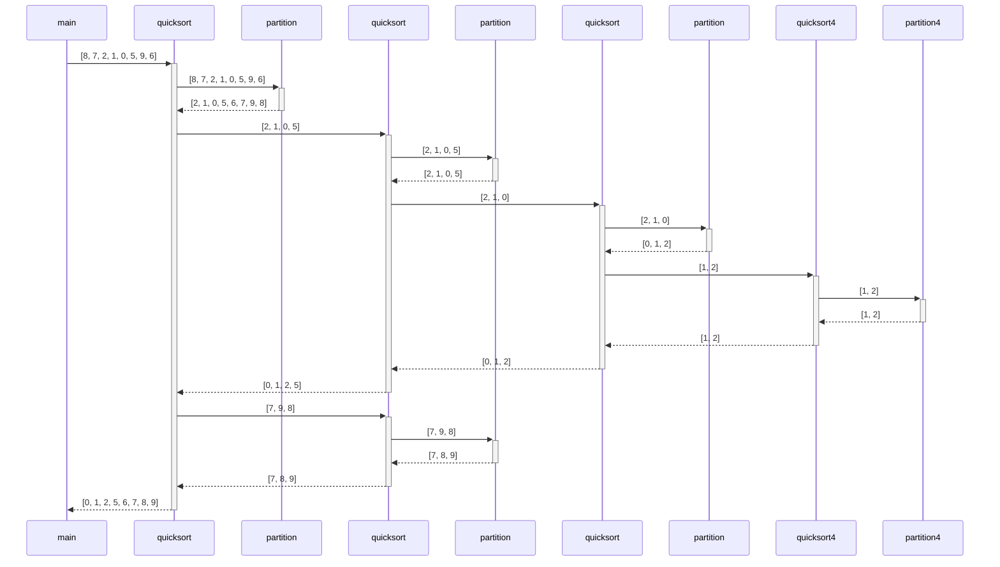

### Python [:arrow_forward:](https://pythontutor.com/visualize.html#code=def%20partition%28array,%20low,%20high%29%3A%0A%20%20%20%20%23%20choose%20the%20rightmost%20element%20as%20pivot%0A%20%20%20%20pivot%20%3D%20array%5Bhigh%5D%0A%0A%20%20%20%20%23%20pointer%20for%20greater%20element%0A%20%20%20%20i%20%3D%20low%20-%201%0A%0A%20%20%20%20%23%20traverse%20through%20all%20elements%0A%20%20%20%20%23%20compare%20each%20element%20with%20pivot%0A%20%20%20%20for%20j%20in%20range%28low,%20high%29%3A%0A%20%20%20%20%20%20%20%20if%20array%5Bj%5D%20%3C%3D%20pivot%3A%0A%20%20%20%20%20%20%20%20%20%20%20%20%23%20if%20element%20smaller%20than%20pivot%20is%20found%0A%20%20%20%20%20%20%20%20%20%20%20%20%23%20swap%20it%20with%20the%20greater%20element%20pointed%20by%20i%0A%20%20%20%20%20%20%20%20%20%20%20%20i%20%3D%20i%20%2B%201%0A%0A%20%20%20%20%20%20%20%20%20%20%20%20%23%20swapping%20element%20at%20i%20with%20element%20at%20j%0A%20%20%20%20%20%20%20%20%20%20%20%20%28array%5Bi%5D,%20array%5Bj%5D%29%20%3D%20%28array%5Bj%5D,%20array%5Bi%5D%29%0A%0A%20%20%20%20%23%20swap%20the%20pivot%20element%20with%20the%20greater%20element%20specified%20by%20i%0A%20%20%20%20%28array%5Bi%20%2B%201%5D,%20array%5Bhigh%5D%29%20%3D%20%28array%5Bhigh%5D,%20array%5Bi%20%2B%201%5D%29%0A%0A%20%20%20%20%23%20return%20the%20position%20from%20where%20partition%20is%20done%0A%20%20%20%20return%20i%20%2B%201%0A%0A%0Adef%20quickSort%28array,%20low,%20high%29%3A%0A%20%20%20%20if%20low%20%3C%20high%3A%0A%20%20%20%20%20%20%20%20%23%20find%20pivot%20element%20such%20that%0A%20%20%20%20%20%20%20%20%23%20element%20smaller%20than%20pivot%20are%20on%20the%20left%0A%20%20%20%20%20%20%20%20%23%20element%20greater%20than%20pivot%20are%20on%20the%20right%0A%20%20%20%20%20%20%20%20pi%20%3D%20partition%28array,%20low,%20high%29%0A%0A%20%20%20%20%20%20%20%20%23%20recursive%20call%20on%20the%20left%20of%20pivot%0A%20%20%20%20%20%20%20%20quickSort%28array,%20low,%20pi%20-%201%29%0A%0A%20%20%20%20%20%20%20%20%23%20recursive%20call%20on%20the%20right%20of%20pivot%0A%20%20%20%20%20%20%20%20quickSort%28array,%20pi%20%2B%201,%20high%29%0A%0A%0Adata%20%3D%20%5B8,%207,%202,%201,%200,%205,%209,%206%5D%0Aprint%28%22Unsorted%3A%22,%20data%29%0AquickSort%28data,%200,%20len%28data%29%20-%201%29%0Aprint%28%22Sorted%3A%20%20%22,%20data%29&cumulative=false&heapPrimitives=nevernest&mode=edit&origin=opt-frontend.js&py=3&rawInputLstJSON=%5B%5D&textReferences=false)

```python
def partition(array, low, high):
    # choose the rightmost element as pivot
    pivot = array[high]

    # pointer for greater element
    i = low - 1

    # traverse through all elements
    # compare each element with pivot
    for j in range(low, high):
        if array[j] <= pivot:
            # if element smaller than pivot is found
            # swap it with the greater element pointed by i
            i = i + 1

            # swapping element at i with element at j
            (array[i], array[j]) = (array[j], array[i])

    # swap the pivot element with the greater element specified by i
    (array[i + 1], array[high]) = (array[high], array[i + 1])

    # return the position from where partition is done
    return i + 1

def quickSort(array, low, high):
    if low < high:
        # find pivot element such that
        # element smaller than pivot are on the left
        # element greater than pivot are on the right
        pi = partition(array, low, high)

        # recursive call on the left of pivot
        quickSort(array, low, pi - 1)

        # recursive call on the right of pivot
        quickSort(array, pi + 1, high)

data = [8, 7, 2, 1, 0, 5, 9, 6]
print("Unsorted:", data)
quickSort(data, 0, len(data) - 1)
print("Sorted:  ", data)
```

### Java [:arrow_forward:](https://pythontutor.com/visualize.html#code=import%20java.util.Arrays%3B%0A%0Apublic%20class%20Main%20%7B%0A%20%20%20%20public%20static%20void%20main%28String%20args%5B%5D%29%20%7B%0A%20%20%20%20%20%20%20%20int%5B%5D%20data%20%3D%20%7B8,%207,%202,%201,%200,%205,%209,%206%7D%3B%0A%20%20%20%20%20%20%20%20System.out.println%28%22Unsorted%3A%20%22%20%2B%20Arrays.toString%28data%29%29%3B%0A%20%20%20%20%20%20%20%20quickSort%28data,%200,%20data.length%20-%201%29%3B%0A%20%20%20%20%20%20%20%20System.out.println%28%22Sorted%3A%20%20%20%22%20%2B%20Arrays.toString%28data%29%29%3B%0A%20%20%20%20%7D%0A%0A%20%20%20%20//%20method%20to%20find%20the%20partition%20position%0A%20%20%20%20static%20int%20partition%28int%20array%5B%5D,%20int%20low,%20int%20high%29%20%7B%0A%20%20%20%20%20%20%20%20//%20choose%20the%20rightmost%20element%20as%20pivot%0A%20%20%20%20%20%20%20%20int%20pivot%20%3D%20array%5Bhigh%5D%3B%0A%0A%20%20%20%20%20%20%20%20//%20pointer%20for%20greater%20element%0A%20%20%20%20%20%20%20%20int%20i%20%3D%20%28low%20-%201%29%3B%0A%0A%20%20%20%20%20%20%20%20//%20traverse%20through%20all%20elements%0A%20%20%20%20%20%20%20%20//%20compare%20each%20element%20with%20pivot%0A%20%20%20%20%20%20%20%20for%20%28int%20j%20%3D%20low%3B%20j%20%3C%20high%3B%20j%2B%2B%29%20%7B%0A%20%20%20%20%20%20%20%20%20%20%20%20if%20%28array%5Bj%5D%20%3C%3D%20pivot%29%20%7B%0A%0A%20%20%20%20%20%20%20%20%20%20%20%20%20%20%20%20//%20if%20element%20smaller%20than%20pivot%20is%20found%0A%20%20%20%20%20%20%20%20%20%20%20%20%20%20%20%20//%20swap%20it%20with%20the%20greatr%20element%20pointed%20by%20i%0A%20%20%20%20%20%20%20%20%20%20%20%20%20%20%20%20i%2B%2B%3B%0A%0A%20%20%20%20%20%20%20%20%20%20%20%20%20%20%20%20//%20swapping%20element%20at%20i%20with%20element%20at%20j%0A%20%20%20%20%20%20%20%20%20%20%20%20%20%20%20%20int%20temp%20%3D%20array%5Bi%5D%3B%0A%20%20%20%20%20%20%20%20%20%20%20%20%20%20%20%20array%5Bi%5D%20%3D%20array%5Bj%5D%3B%0A%20%20%20%20%20%20%20%20%20%20%20%20%20%20%20%20array%5Bj%5D%20%3D%20temp%3B%0A%20%20%20%20%20%20%20%20%20%20%20%20%7D%0A%0A%20%20%20%20%20%20%20%20%7D%0A%0A%20%20%20%20%20%20%20%20//%20swapt%20the%20pivot%20element%20with%20the%20greater%20element%20specified%20by%20i%0A%20%20%20%20%20%20%20%20int%20temp%20%3D%20array%5Bi%20%2B%201%5D%3B%0A%20%20%20%20%20%20%20%20array%5Bi%20%2B%201%5D%20%3D%20array%5Bhigh%5D%3B%0A%20%20%20%20%20%20%20%20array%5Bhigh%5D%20%3D%20temp%3B%0A%0A%20%20%20%20%20%20%20%20//%20return%20the%20position%20from%20where%20partition%20is%20done%0A%20%20%20%20%20%20%20%20return%20%28i%20%2B%201%29%3B%0A%20%20%20%20%7D%0A%0A%20%20%20%20static%20void%20quickSort%28int%20array%5B%5D,%20int%20low,%20int%20high%29%20%7B%0A%20%20%20%20%20%20%20%20if%20%28low%20%3C%20high%29%20%7B%0A%20%20%20%20%20%20%20%20%20%20%20%20//%20find%20pivot%20element%20such%20that%0A%20%20%20%20%20%20%20%20%20%20%20%20//%20elements%20smaller%20than%20pivot%20are%20on%20the%20left%0A%20%20%20%20%20%20%20%20%20%20%20%20//%20elements%20greater%20than%20pivot%20are%20on%20the%20right%0A%20%20%20%20%20%20%20%20%20%20%20%20int%20pi%20%3D%20partition%28array,%20low,%20high%29%3B%0A%0A%20%20%20%20%20%20%20%20%20%20%20%20//%20recursive%20call%20on%20the%20left%20of%20pivot%0A%20%20%20%20%20%20%20%20%20%20%20%20quickSort%28array,%20low,%20pi%20-%201%29%3B%0A%0A%20%20%20%20%20%20%20%20%20%20%20%20//%20recursive%20call%20on%20the%20right%20of%20pivot%0A%20%20%20%20%20%20%20%20%20%20%20%20quickSort%28array,%20pi%20%2B%201,%20high%29%3B%0A%20%20%20%20%20%20%20%20%7D%0A%20%20%20%20%7D%0A%7D&cumulative=false&heapPrimitives=nevernest&mode=edit&origin=opt-frontend.js&py=java&rawInputLstJSON=%5B%5D&textReferences=false)

```java
import java.util.Arrays;

public class Main {
    public static void main(String args[]) {
        int[] data = {8, 7, 2, 1, 0, 5, 9, 6};
        System.out.println("Unsorted: " + Arrays.toString(data));
        quickSort(data, 0, data.length - 1);
        System.out.println("Sorted:   " + Arrays.toString(data));
    }

    // method to find the partition position
    static int partition(int array[], int low, int high) {
        // choose the rightmost element as pivot
        int pivot = array[high];

        // pointer for greater element
        int i = (low - 1);

        // traverse through all elements
        // compare each element with pivot
        for (int j = low; j < high; j++) {
            if (array[j] <= pivot) {

                // if element smaller than pivot is found
                // swap it with the greatr element pointed by i
                i++;

                // swapping element at i with element at j
                int temp = array[i];
                array[i] = array[j];
                array[j] = temp;
            }

        }

        // swapt the pivot element with the greater element specified by i
        int temp = array[i + 1];
        array[i + 1] = array[high];
        array[high] = temp;

        // return the position from where partition is done
        return (i + 1);
    }

    static void quickSort(int array[], int low, int high) {
        if (low < high) {
            // find pivot element such that
            // elements smaller than pivot are on the left
            // elements greater than pivot are on the right
            int pi = partition(array, low, high);

            // recursive call on the left of pivot
            quickSort(array, low, pi - 1);

            // recursive call on the right of pivot
            quickSort(array, pi + 1, high);
        }
    }
}
```
